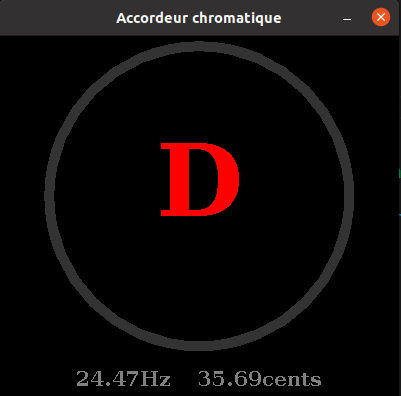

# chromatic tuner Java with Swing 

### 1 - lancer les tests pour vérifier les fonctionnalités 

### 2 - Fichier config.Config :   
&nbsp;&nbsp;&nbsp;&nbsp;&nbsp;&nbsp;- il est possible de régler la durée de l'enregistrement pour l'analyse de fréquence  
&nbsp;&nbsp;&nbsp;&nbsp;&nbsp;&nbsp;- le maxByteSize doit obligatoirement être une puissance de deux pour analyse du signal par fast fourier transform  
&nbsp;&nbsp;&nbsp;&nbsp;&nbsp;&nbsp;- la détection de fait uniquement sur la plage 50Hz - 3000Hz. Au dessus de 3000Hz les résulats sont erronés.  
&nbsp;&nbsp;&nbsp;&nbsp;&nbsp;&nbsp;- le recordingSampleRate peut être dépend du micro de l'ordinateur  

### 3 - la classe analyse.FileToByte a deux fonctions readfully :   
&nbsp;&nbsp;&nbsp;&nbsp;&nbsp;&nbsp;- pour tester un fichier wav (utilisé dans les tests)  
&nbsp;&nbsp;&nbsp;&nbsp;&nbsp;&nbsp;- pour transformer le signal byte little endian en double   
&nbsp;&nbsp;&nbsp;&nbsp;&nbsp;&nbsp;- tronquer le signal selon une puissance de seux définie dans config.Config  
&nbsp;&nbsp;&nbsp;&nbsp;&nbsp;&nbsp;- transformer le signal 2 canaux en 1 canal  

### 4 - la classe analyse.MainFrequencyAnalyser effetue la FFT, et calcule la fréquence principale  

### 5 - la classe analyse.WafFileHelper transforme l'entrée micro en son wave (en-têtes, etc)  

### 6 - le dossier front gère la partie graphique de l'application :   
&nbsp;&nbsp;&nbsp;&nbsp;&nbsp;&nbsp;- Fenetre : JFrame, boucle de détection  
&nbsp;&nbsp;&nbsp;&nbsp;&nbsp;&nbsp;- FenetrePanel : le JPanel avec écriture des résultats de détection  
&nbsp;&nbsp;&nbsp;&nbsp;&nbsp;&nbsp;- isAccorded ; une enum de couleurs utilisée par FenetrePanel  

### 7 - notes :   
&nbsp;&nbsp;&nbsp;&nbsp;&nbsp;&nbsp;- Accordage : objet note (enum) détectée, écart en Hz, écart en cents  
&nbsp;&nbsp;&nbsp;&nbsp;&nbsp;&nbsp;- CalculateNoteFrequencies : trouver note, écart en Hz et cents selon la fréquence issue de (4)  
&nbsp;&nbsp;&nbsp;&nbsp;&nbsp;&nbsp;- Frequences : object regroupant les noms des notes et leurs fréquences, celles-si sont calculées par la classe précédente  
&nbsp;&nbsp;&nbsp;&nbsp;&nbsp;&nbsp;- Notes : enum des noms de notes  

### 8 - app.py : fichier python :   
&nbsp;&nbsp;&nbsp;&nbsp;&nbsp;&nbsp;- python offre d'avantage de facilités pour trouver la fréquence principale grace à NumPy, et permet de vérifier la cohérence des résultats par rapport à java. L'enregistrement n'est pas implémenté dans cette classe, mais est disponible dans un de mes autres repo github, donc seul un fichier wave peut-être testé. (idéalement entre une et deux secondes).  
Dépendances : scipy numpy matplotlib
  

Le temps d'analyse moyen est d'environ 5ms (Ubuntu, I7, 8Gb de Ram), en compilation à la volée en console de VsCode.
